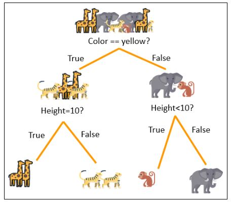

# decision_tree_from_scratch

## A High Level Understanding

### What is it?

A decision Tree is a supervised learning method used to predict the output of a target variable
<a align="center">
    
</a>

---

### Important Terms

1. **Entropy**: Measure of uncertainty or randomness in a dataset. 
    1. It handles how a decision tree splits the data. 
    2. It is calculated using the following formula:

$$\sum_{i=1}^{k}P(\text{value}_i) \cdot \log_2(P(\text{value}_i))$$
    
2. **Information Gain**: Measures the decrease in entropy after the data set is split. 
    1. It is calculated as follows:
$$IG(Y,X) = \text{Entropy}(Y) - \text{Entropy}(Y|X)$$
    
    or in more detail its given as:
$$IG(D_p, f) = E(D_p) - \frac{N_{left}}{N} E(D_{left}) - \frac{N_{right}}{N} E(D_{right})$$
    
    💡 where:
    
    - $f$         is Feature Split on
    - $D_p$       is Dataset of Parent Node
    - $D_{left}$  is Dataset of Left Child Node
    - $D_{right}$ is Dataset of Right Child Node
    - $E$         is Impurity Criterion (Entropy)
    - $N$         is the Total Number of samples
    - $N_{left}$  is the Total Number of Samples at Left Child Node
    - $N_{right}$ is the Total Number of Samples at Right Child Node
    
3. **Gain Ratio**: Gain ratio handles the issue of bias by normalizing the information gain using Split Info:

$$
\text{SplitInfo}_A(D) = -\sum_{j=1}^v \frac{|D_j|}{|D|} \log \left(\frac{|D_j|}{|D|}\right)
$$
    
    💡 Where
    
    - $\frac{|D_j|}{|D|}$    acts as the weight of the jth partition
    - $v$       is the number of discrete values in attribute A
    
    Gain Ratio:
$$\text{GainRatio}(A) = \frac{\text{Gain}(A)}{\text{SplitInfo}_A(D)}$$
    
    The Attribute with the highest gain ratio is chosen as the splitting attribute.
    
6. **Gini Index**: Used to determine the correct variable for splitting nodes. 
    1. It measures how often a randomly chosen variable would be incorrectly identified. 
$$\text{Gini}(D) = 1 - \sum_{i=1}^m P_i^2$$
    
    💡 Where
    - $P_i$ is the probability that a tuple in $D$ belongs to class $C_i$
    
7. **Root Node**: The top node of a decision tree. Represents the entire data sample.
8. **Decision Node**: Subnodes that can be split into different Subnodes
    1. They contain at least two branches.
9. **Leaf Node**: Carries the final Results. Also known as terminal nodes. 
    1. Cannot be split further.


---

# The Code

**Import Libraries**

```python
# Load libraries
import pandas as pd
from sklearn.tree import DecisionTreeClassifier # Import Decision Tree Classifier
from sklearn.model_selection import train_test_split # Import train_test_split function
from sklearn import metrics #Import scikit-learn metrics module for accuracy calculation
```

**Loading Data**

[Pima Indians Diabetes Database](https://www.kaggle.com/datasets/uciml/pima-indians-diabetes-database?resource=download)

[diabetes.csv](https://prod-files-secure.s3.us-west-2.amazonaws.com/b2d0552a-437e-4bb3-8904-b3b588bb0ac2/282e1ff5-1ff5-4bc2-9e44-5d42c47c4444/diabetes.csv)

```python
col_names = ['pregnant', 'glucose', 'bp', 'skin', 'insulin', 'bmi', 'pedigree', 'age', 'label']
# load dataset
pima = pd.read_csv("diabetes.csv", header=None, names=col_names)
```

Display data

```python
pima.head()
```

**Feature Selection**

```python
#split dataset in features and target variable
feature_cols = ['pregnant', 'insulin', 'bmi', 'age','glucose','bp','pedigree']
X = pima[feature_cols] # Features
y = pima.label # Target variable
```

**Splitting The data**

```python
# Split dataset into training set and test set
X_train, X_test, y_train, y_test = train_test_split(X, y, test_size=0.3, random_state=1) # 70% training and 30% test
```

**Building a Decision Tree Model**

```python
# Create Decision Tree classifer object
clf = DecisionTreeClassifier()

# Train Decision Tree Classifer
clf = clf.fit(X_train,y_train)

#Predict the response for test dataset
y_pred = clf.predict(X_test)
```

**Evaluating the Model**

```python
# Model Accuracy, how often is the classifier correct?
print("Accuracy:",metrics.accuracy_score(y_test, y_pred))
```

---

## Visualisation of the Trees

```python
from sklearn.tree import export_graphviz
from sklearn.externals.six import StringIO  
from IPython.display import Image  
import pydotplus
```

```python
dot_data = StringIO()
export_graphviz(clf, out_file=dot_data,  
                filled=True, rounded=True,
                special_characters=True,feature_names = feature_cols,class_names=['0','1'])
graph = pydotplus.graph_from_dot_data(dot_data.getvalue())  
graph.write_png('diabetes.png')
Image(graph.create_png())
```

$output:$


---

## Optimization

- **criterion : optional (default=”gini”) or Choose attribute selection measure.** This parameter allows us to use the different-different attribute selection measure.
    - Supported criteria are
        - “gini” for the Gini index
        - “entropy” for the information gain.
- **splitter : string, optional (default=”best”) or Split Strategy.** This parameter allows us to choose the split strategy.
    - Supported strategies are
        - “best” to choose the best split
        - “random” to choose the best random split.
- **max_depth : int or None, optional (default=None) or Maximum Depth of a Tree.** The maximum depth of the tree. If None, then nodes are expanded until all the leaves contain less than min_samples_split samples. The higher value of maximum depth causes overfitting, and a lower value causes underfitting.
